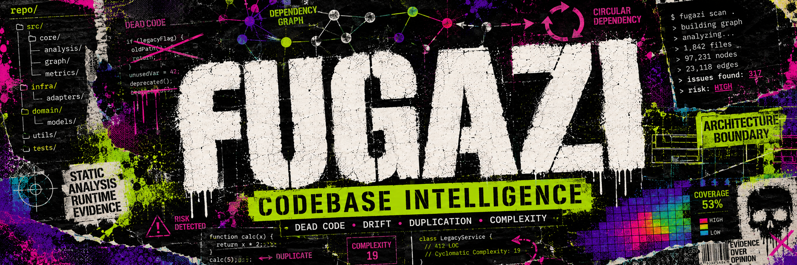

<p align="center">
  
</p>

# Fugazi

**Codebase intelligence for TypeScript, JavaScript, and Python.**

Fugazi analyzes a whole project — its module graph, re-export chains, and cross-references — to surface dead code, duplication, complexity, and architecture drift. It runs on Bun for speed and on Node 22+ for compatibility, and it can fold in production runtime evidence to tell you not just what's wrong, but what actually matters.

---

## What it finds

**Dead code**
- Unused files, exports, and types
- Unused dependencies (`dependencies`, `devDependencies`, `optionalDependencies`)
- Unused enum members and class members
- Unresolved imports, unlisted dependencies, duplicate exports
- Private types leaking across module boundaries

**Structure & architecture**
- Circular dependencies (deterministic cycle reporting)
- Architecture drift — boundary/zone violations (e.g. "the `api` layer may not import `db`")

**Duplication**
- Clone detection from exact copies through renamed and reordered near-duplicates

**Complexity & health**
- Per-function cyclomatic and cognitive complexity
- Maintainability scoring and ranked refactor targets

**Runtime intelligence** (optional, when you supply V8 coverage)
- Hot paths — where execution actually concentrates
- Cold code — shipped but never executed at runtime
- Runtime-weighted refactor priority — complexity weighted by how often code runs, so you fix the gnarly-and-hot first and simply delete the gnarly-and-dead
- Coverage gaps — files with no runtime evidence at all

---

## Languages

TypeScript / TSX, JavaScript / JSX, and Python (`.py`, `.pyi`). A mixed TypeScript + Python monorepo analyzes in a **single pass** — each file is routed by extension and the findings merge into one report. See [`docs/PYTHON.md`](docs/PYTHON.md) for the Python contract (manifests, decorators, `TYPE_CHECKING`, `__all__`, namespace packages).

Framework boilerplate is handled by declarative plugins, so files your framework invokes by convention (routes, migrations, fixtures, entry modules) aren't mistaken for dead code. ~30 Python frameworks ship built in (Flask, FastAPI, Django, SQLAlchemy, pytest, Pydantic, Celery, Click, and more) alongside JavaScript framework plugins.

---

## Surfaces

Fugazi is the same engine exposed five ways:

| Surface | What it is |
| --- | --- |
| **CLI** — `fugazi` | The command-line tool (the published package) |
| **LSP** — `fugazi-lsp` | Editor diagnostics, code actions, hovers, and code lens |
| **MCP** — `fugazi-mcp` | A Model Context Protocol server so AI agents can call the analyzer over stdio |
| **Editors** | VS Code and Zed extensions |
| **CI** | A GitHub composite Action and a GitLab CI template |

---

## Quickstart

```bash
bun install
bun run build
```

Then, from inside a project:

```bash
fugazi init           # optional: scaffold .fugazirc.json to tune rules / zones / entry points

fugazi dead-code      # all dead-code rules
fugazi dupes          # duplication
fugazi health --score # complexity + a project health score
```

`fugazi` requires a subcommand. Each analysis command operates on the current directory and honors your configuration (entry points, zones, rule severities).

### CLI commands

| Command | Purpose |
| --- | --- |
| `fugazi dead-code` | Run the full dead-code family |
| `fugazi dupes` | Clone / duplication detection |
| `fugazi health [--score]` | Complexity, maintainability, refactor targets |
| `fugazi boundaries` | Only the architecture boundary rule |
| `fugazi circular-deps` | Only the circular-dependency rule |
| `fugazi unused-files` \| `unused-exports` \| `unused-types` \| `unused-deps` | Focused single-rule runs |
| `fugazi audit` | Read-only inventory dump (no rules) — useful for debugging extraction |
| `fugazi coverage setup` | Wire up V8 coverage capture for the runtime layer |
| `fugazi fix [--dry-run] [--rule <id>]` | Apply available fixes (e.g. suppression insertion) |
| `fugazi trace [--file <f>] [--export <name>]` | Trace why a file or export is (un)reachable |
| `fugazi watch` | Re-analyze on file changes |
| `fugazi explain <rule-id>` | Describe a rule and why it fires |
| `fugazi schema [--markdown]` | Print the configuration schema |

Common flags: `--format <fmt>` (human, `json`, `sarif`, `codeclimate`, `markdown`, `compact`), `--quiet` / `-q`, `--preset <name>`.

**Exit codes** are a closed set: `0` (clean), `1` (findings at `warn`/`error`), `2` (usage/config error) — never anything else, so Fugazi is safe to gate CI on.

---

## Configuration

Fugazi reads configuration in priority order (first match wins; formats are not merged):

1. `.fugazirc.json`
2. `fugazi.config.ts`
3. `fugazi.toml`

`fugazi init` scaffolds a starter file, and `fugazi schema --markdown` prints the full reference. Every rule resolves to a severity: `error` (reported, fails CI), `warn` (reported, exit stays `0`), or `off`.

Suppress individual findings inline:

```ts
// fugazi-ignore-next-line [issue-type]
// fugazi-ignore-file [issue-type]
```

`[issue-type]` is optional; omit it to suppress all types for that scope. See [`CONVENTIONS.md`](CONVENTIONS.md) for the full behavioral reference (config resolution, severities, suppression, environment variables, determinism).

---

## How it works

A single pipeline drives every surface. `runAnalysis()` runs six phases, passing live data structures forward:

```
discover → extract → graph → analyze → cross-reference → runtime
```

1. **discover** — enumerate source files, apply excludes.
2. **extract** — parse each file with WASM parsers; build a per-file inventory (declarations, imports, exports, usages) and complexity metrics. Parse errors never abort the run.
3. **graph** — build the module dependency graph, resolve imports and re-export chains, assign stable path-sorted file IDs.
4. **analyze** — dispatch the detection rules against the graph.
5. **cross-reference** — collapse redundant findings and apply framework-plugin knowledge so framework-invoked files aren't flagged.
6. **runtime** — *(optional)* if V8 coverage is supplied, produce the runtime report.

For the full design — the rule registry, the plugin schema, the runtime pipeline, and the determinism contract — see [**`docs/ARCHITECTURE.md`**](docs/ARCHITECTURE.md).

---

## Design principles

- **Deterministic.** The same input produces byte-identical output, every time and on every machine — across all reporter formats. File IDs are path-sorted, iteration order is fixed, and there's no clock or randomness in any analysis path. This is what makes Fugazi trustworthy as a CI gate.
- **Syntactic.** Fugazi reasons about structure directly from the AST. It does not run the TypeScript type-checker, which keeps analysis fast and dependency-light.
- **Whole-project.** Findings come from the resolved module graph (including re-export chains and dynamic-import reachability), not file-at-a-time heuristics.
- **Fail-soft.** A file that fails to parse is recorded and skipped; it never takes down the run.

---

## Programmatic API

The analyzer is available as a library via `@fugazi/node`:

```ts
import { analyze } from '@fugazi/node';

const result = await analyze({ projectRoot: process.cwd() });
for (const issue of result.issues) {
  console.log(`${issue.severity} ${issue.kind} ${issue.file}: ${issue.message}`);
}
```

Findings are a discriminated union keyed on `kind`, so each variant carries exactly the fields it needs (a `circular-dependencies` issue has a `cycle`, a `boundary-violations` issue has `from`/`to`/`fromZone`/`toZone`, and so on).

---

## Workspace structure

Fugazi is a Bun-workspace monorepo. The pipeline flows left-to-right through these packages:

```
packages/
  types/         @fugazi/types        Shared type definitions
  config/        @fugazi/config       Config loading, schema, framework detection
  extract/       @fugazi/extract      AST extraction, complexity, parse cache, SFC handlers
  graph/         @fugazi/graph        Module graph, import & re-export resolution
  v8-coverage/   @fugazi/v8-coverage  V8 ScriptCoverage parser + line/col mapper
  core/          @fugazi/core         Orchestration: rules, dedup, health, runtime
  runtime/       @fugazi/runtime      Runtime-intelligence layer
  node-api/      @fugazi/node         Programmatic Node API
  cli/           fugazi               CLI binary (the published package)
  lsp/           @fugazi/lsp          Language Server
  mcp/           @fugazi/mcp          MCP server for AI agents
  plugins/       @fugazi/plugins      Declarative framework plugins (JSON; experimental TS tier)

editors/         VS Code + Zed extensions
action/          GitHub composite Action
ci/              GitLab CI template
decisions/       Architecture Decision Records (ADRs)
docs/            Documentation
fixtures/        Conformance & project fixtures
```

The internal `@fugazi/*` packages are private; only `fugazi` (from `packages/cli/`) is published, bundling the workspace outputs into a single ESM package.

---

## Building & testing

From the repo root:

```bash
bun install         # install (npm install --workspaces also works)
bun run build       # build all packages (Turborepo)
bun run typecheck   # tsc --noEmit across the workspace
bun run test        # Vitest across all packages
bun run lint        # Biome
bun run dev:watch   # build --watch + test --watch
```

Node-only contributors can substitute `npm install --workspaces && npm run build && npm test`; CI runs both lanes.

---

## Documentation

- [`docs/ARCHITECTURE.md`](docs/ARCHITECTURE.md) — the full system design
- [`docs/PYTHON.md`](docs/PYTHON.md) — Python support and contract
- [`CONVENTIONS.md`](CONVENTIONS.md) — configuration, severities, suppression, determinism
- [`CONTRIBUTING.md`](CONTRIBUTING.md) — workflow, branch model, ADR process

## License

MIT — see [`LICENSE`](LICENSE).
